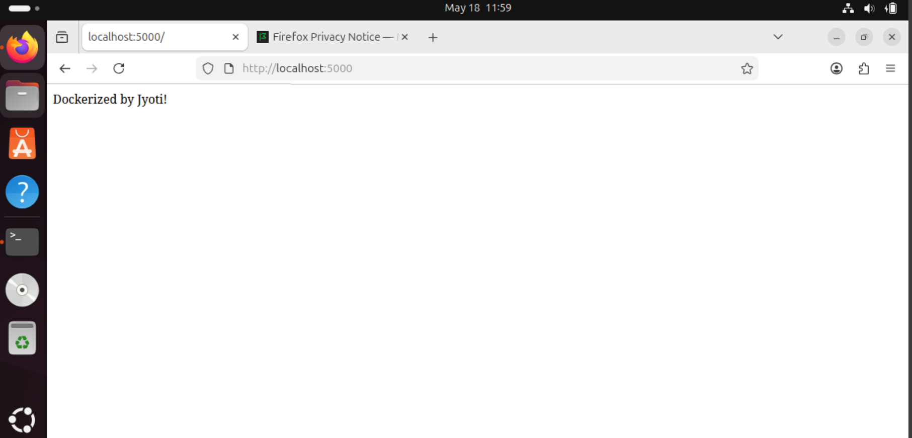
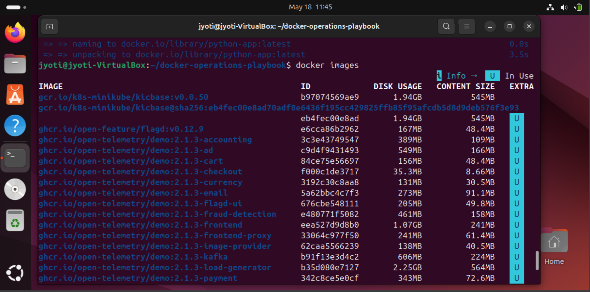
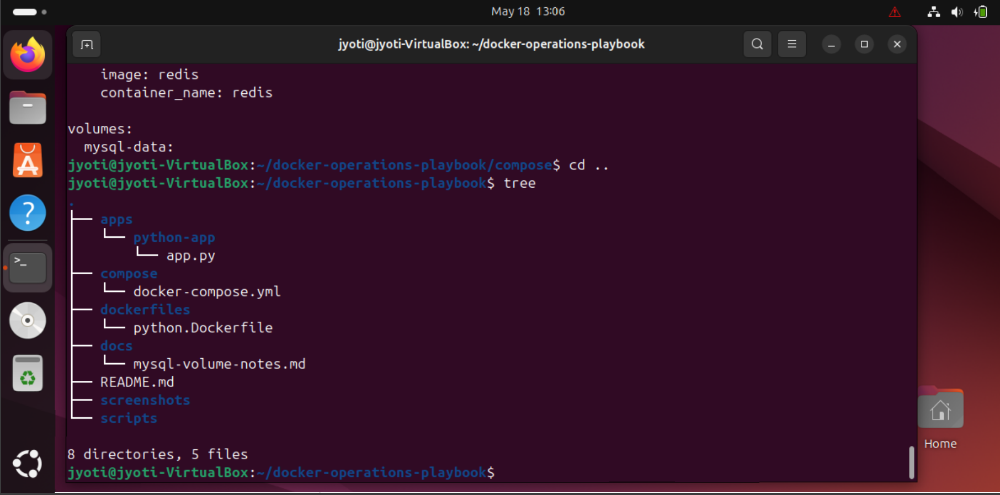
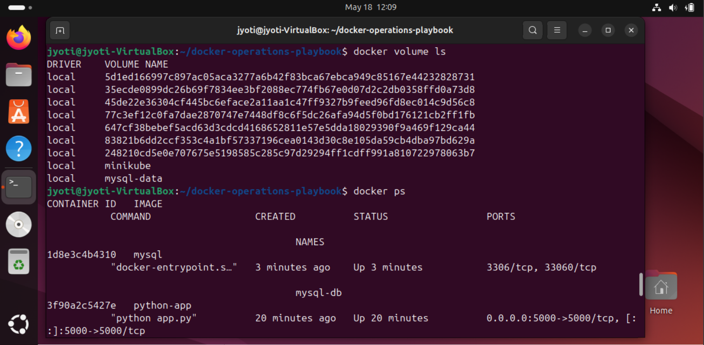

# Docker Operations Playbook 🚀

Production-style Docker project built for hands-on DevOps practice, focusing on containerization, persistent storage, multi-container orchestration, operational automation, and troubleshooting.

---

## Tech Stack

- Docker
- Docker Compose
- Python
- Flask
- MySQL
- Redis
- Linux
- Bash
- Git

---

## Features

- Custom Dockerfile creation
- Python application containerization
- Persistent MySQL storage
- Redis cache integration
- Multi-container orchestration using Docker Compose
- Backup automation using Bash scripting
- Operational troubleshooting documentation
- Infrastructure documentation

---

## Project Structure

```bash
docker-operations-playbook/
├── apps/
├── compose/
├── dockerfiles/
├── docs/
├── screenshots/
├── scripts/
└── README.md
```

---

## Services

### Python Application

- Port: `5000`

### MySQL Database

- Persistent storage using Docker volumes

### Redis Cache

- Internal service communication

---

## Commands

### Build Application Image

```bash
docker build -t python-app -f dockerfiles/python.Dockerfile .
```

### Run Multi-Container Environment

```bash
docker compose -f compose/docker-compose.yml up -d
```

### Run Backup Script

```bash
./scripts/backup.sh
```

### Check Running Containers

```bash
docker ps
```

---

## Learning Outcomes

- Container lifecycle management
- Docker image creation
- Volume management
- Container networking
- Multi-service orchestration
- Bash automation
- Operational troubleshooting
- Infrastructure documentation

---

## Screenshots

### Application Running



### Running Containers



### Multi-Container Services



### Persistent Storage



---

## Author

Built with hands-on learning and operational practice by Jyoti.
